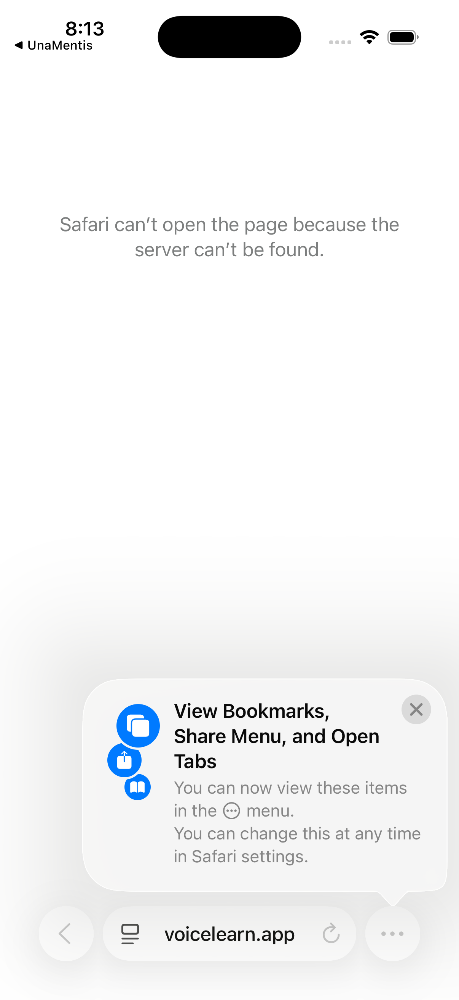

# Navigation Architecture

**Version:** 1.0.0
**Last Updated:** 2026-01-16
**Platform:** iOS (Swift/SwiftUI)

---

## Overview

UnaMentis uses a 5-tab navigation structure with a "More" menu containing additional features. This architecture supports both iPhone and iPad layouts with adaptive navigation patterns.

---

## Tab Bar Structure

```
┌─────────────────────────────────────────────────────────────┐
│                        UnaMentis                             │
├─────────────────────────────────────────────────────────────┤
│                                                              │
│                    [Main Content Area]                       │
│                                                              │
├──────────┬──────────┬──────────┬──────────┬─────────────────┤
│ Session  │ Learning │  To-Do   │ History  │      More       │
│   🎙️     │    📚    │    ✓     │    🕐    │      •••        │
└──────────┴──────────┴──────────┴──────────┴─────────────────┘
```

### Primary Tabs

| Tab | Icon | Purpose | Default State |
|-----|------|---------|---------------|
| Session | Microphone waveform | Voice conversations | Idle, ready to record |
| Learning | Book | Content & modules | Segmented: Curriculum / Modules |
| To-Do | Checkmark list | Learning goals | Filter by status |
| History | Clock | Session replay | Chronological list |
| More | Ellipsis (•••) | Additional features | Menu with Analytics & Settings |

### Learning Tab Sections

The Learning tab contains a segmented control with two sections (when Modules feature flag is enabled):

| Section | Icon | Purpose |
|---------|------|---------|
| Curriculum | Book | Browse and import UMCF curricula |
| Modules | Stacked squares | Specialized training modules (Knowledge Bowl, SAT, etc.) |

When the Modules feature is disabled, the tab displays only the Curriculum section.

### More Menu Contents

The "More" tab reveals a simple menu with two options:

| Item | Icon | Destination |
|------|------|-------------|
| Analytics | Bar chart | Metrics dashboard |
| Settings | Gear | App configuration |



---

## Navigation Hierarchy

```
UnaMentis
├── Session Tab
│   ├── Voice Session (main view)
│   ├── Session Settings (gear icon)
│   └── Help (question mark icon)
│
├── Learning Tab
│   ├── [Segmented Control: Curriculum | Modules]
│   │
│   ├── Curriculum Section
│   │   ├── Curriculum List
│   │   │   └── Curriculum Detail
│   │   │       ├── Topic List
│   │   │       │   └── Topic Detail
│   │   │       └── Visual Assets
│   │   └── Import Flow (modal)
│   │       ├── Source Selection
│   │       ├── Import Progress
│   │       └── Import Complete
│   │
│   └── Modules Section
│       ├── Module List (server-delivered)
│       │   └── Module Detail Sheet (modal)
│       │       ├── Download Module
│       │       └── Launch Module
│       │
│       └── Module Views (full screen)
│           ├── Knowledge Bowl
│           │   ├── KB Dashboard
│           │   ├── KB Practice Launcher
│           │   ├── KB Written Session
│           │   ├── KB Oral Session
│           │   └── KB Validation Setup
│           └── SAT Preparation (future)
│
├── To-Do Tab
│   ├── To-Do List (with filters)
│   │   └── To-Do Detail
│   └── Add Item (modal)
│
├── History Tab
│   ├── Session History List
│   │   └── Session Detail
│   │       ├── Transcript View
│   │       └── Export Options
│   └── Clear History (action)
│
└── More Tab
    ├── Analytics
    │   ├── Stats Overview
    │   ├── Latency Metrics
    │   ├── Cost Breakdown
    │   └── Export (share sheet)
    │
    └── Settings
        ├── API Providers
        │   ├── AssemblyAI (STT)
        │   ├── Deepgram (STT + TTS)
        │   ├── OpenAI (LLM)
        │   ├── Anthropic (LLM)
        │   ├── ElevenLabs (TTS)
        │   ├── Groq (STT)
        │   └── LiveKit (Real-time)
        ├── Session Cost Estimates
        ├── Voice & AI Settings
        ├── Self-Hosted Server
        ├── Debug & Testing
        │   ├── Subsystem Diagnostics
        │   ├── Device Health Monitor
        │   ├── Audio Pipeline Test
        │   ├── Provider Connectivity
        │   ├── TTS Playback Tuning
        │   └── Conversation Test
        ├── Help
        │   ├── Help & Voice Commands
        │   ├── Siri Voice Commands
        │   └── Show Welcome Tour
        └── About
            ├── Version
            ├── Documentation
            └── Privacy Policy
```

---

## Navigation Patterns

### Push Navigation
Used for drilling down into content:
- Curriculum List → Curriculum Detail → Topic Detail
- History List → Session Detail
- Settings → Provider Configuration

### Modal Presentation
Used for focused tasks:
- Import Curriculum flow
- Add To-Do item
- Export dialogs
- Help overlays

### Tab Switching
- Tabs maintain their navigation state independently
- Switching tabs preserves scroll position and sub-navigation
- Double-tap on active tab scrolls to top / pops to root

### Back Navigation
- Standard iOS back button in navigation bar
- Swipe from left edge gesture supported
- "< Back" text shows parent screen title

---

## Deep Linking

### URL Scheme

```
unamentis://
```

### Supported Deep Links

| Path | Description | Parameters |
|------|-------------|------------|
| `/session` | Open Session tab | `curriculum_id`, `topic_id` |
| `/session/start` | Start new session | `curriculum_id`, `topic_id` |
| `/curriculum` | Open Curriculum tab | - |
| `/curriculum/{id}` | Open specific curriculum | - |
| `/curriculum/import` | Open import flow | `source` |
| `/todo` | Open To-Do tab | `filter` |
| `/history` | Open History tab | - |
| `/history/{id}` | Open session detail | - |
| `/analytics` | Open Analytics | - |
| `/settings` | Open Settings | `section` |

### Examples

```
# Start session with specific topic
unamentis://session/start?curriculum_id=abc&topic_id=123

# Open settings to providers section
unamentis://settings?section=providers

# Import from specific source
unamentis://curriculum/import?source=brilliant
```

---

## State Management

### Global State (AppState)

The `AppState` singleton manages app-wide state accessible from any view:

```swift
@MainActor
class AppState: ObservableObject {
    @Published var selectedTab: Tab = .session
    @Published var isSessionActive: Bool = false
    @Published var activeCurriculum: Curriculum?
    @Published var activeTopic: Topic?
    @Published var connectionStatus: ConnectionStatus = .disconnected
}
```

### Tab-Specific ViewModels

Each major feature area has its own ViewModel:

| ViewModel | Responsibility |
|-----------|----------------|
| `SessionViewModel` | Voice session state, recording, playback |
| `CurriculumViewModel` | Curriculum list, import, selection |
| `TodoViewModel` | To-do items, filters, CRUD operations |
| `HistoryViewModel` | Session history, export |
| `AnalyticsViewModel` | Metrics aggregation, display |
| `SettingsViewModel` | Configuration, provider management |

### Persistence

| Data Type | Storage | Sync |
|-----------|---------|------|
| Curricula | Core Data | Server sync |
| Sessions | Core Data | Server sync |
| To-Do Items | Core Data | Server sync |
| Settings | UserDefaults | Local only |
| API Keys | Keychain | Local only |

---

## Adaptive Layouts

### iPhone Layout
- Single column navigation
- Full-screen tab content
- Bottom sheet modals
- Compact control sizing

### iPad Layout
- Split view navigation where appropriate
- Sidebar for Curriculum and History
- Popover modals
- Expanded control sizing
- Keyboard shortcuts supported

### Layout Detection

```swift
@Environment(\.horizontalSizeClass) var horizontalSizeClass

var isCompact: Bool {
    horizontalSizeClass == .compact
}
```

---

## Accessibility

### VoiceOver Support
- All tabs have descriptive labels
- Navigation announcements on tab switch
- Custom actions for complex controls

### Tab Bar Accessibility

```swift
.accessibilityLabel("Session")
.accessibilityHint("Double-tap to begin a voice conversation")
```

### Reduce Motion
- Tab transitions respect `UIAccessibility.isReduceMotionEnabled`
- Animated indicators can be disabled

---

## Related Documentation

- [02-SESSION_TAB.md](02-SESSION_TAB.md) - Voice session UI details
- [03-CURRICULUM_TAB.md](03-CURRICULUM_TAB.md) - Content browsing
- [08-SIRI_SHORTCUTS.md](08-SIRI_SHORTCUTS.md) - Voice command integration
- [10-ACCESSIBILITY.md](10-ACCESSIBILITY.md) - Full accessibility guide
