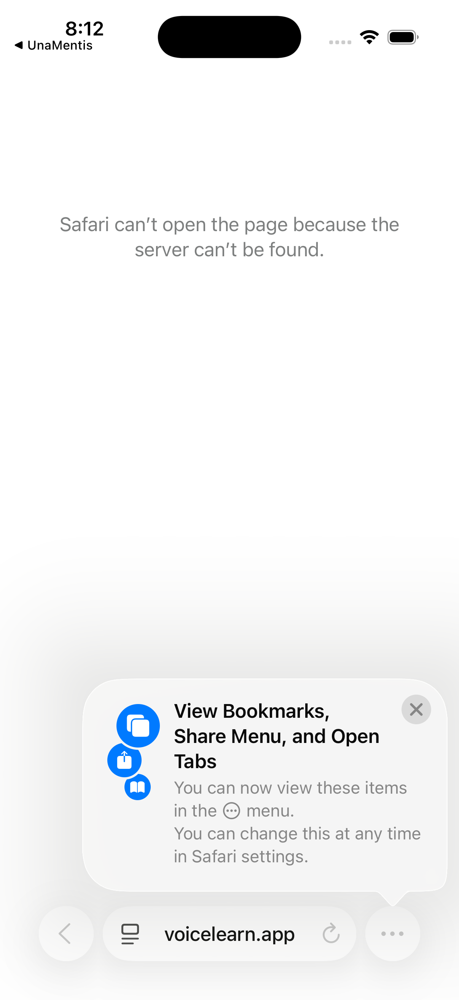

# History Tab

**Version:** 1.0.0
**Last Updated:** 2026-01-16
**Platform:** iOS (Swift/SwiftUI)

---

## Overview

The History tab provides access to past learning sessions. Users can review transcripts, replay sessions, export content, and track their learning journey over time.



---

## View Structure

```
History Tab
├── Search Bar
├── Filter/Sort Controls
├── Session List
│   ├── Empty State
│   └── Session Cards (grouped by date)
└── Session Detail
    ├── Transcript View
    ├── Visual Assets
    ├── Metrics Summary
    └── Export Options
```

---

## Session List

### Empty State

When no sessions exist:
- Clock icon with question mark
- "No Sessions Yet" heading
- "Your conversation history will appear here after your first session." subtext

### Populated List

Sessions grouped by date:

```
┌──────────────────────────────────────┐
│ [Logo]        History          [?]   │
├──────────────────────────────────────┤
│ 🔍 Search sessions...                │
├──────────────────────────────────────┤
│ Today                                │
│ ┌──────────────────────────────────┐ │
│ │ Newton's Laws                    │ │
│ │ Physics • 15 min • 12 turns      │ │
│ │ 8:30 AM                          │ │
│ └──────────────────────────────────┘ │
│                                      │
│ Yesterday                            │
│ ┌──────────────────────────────────┐ │
│ │ Derivatives Introduction         │ │
│ │ Calculus • 22 min • 18 turns     │ │
│ │ 3:45 PM                          │ │
│ └──────────────────────────────────┘ │
│                                      │
│ This Week                            │
│ ┌──────────────────────────────────┐ │
│ │ Thermodynamics Basics            │ │
│ │ Physics • 8 min • 6 turns        │ │
│ │ Monday, 10:15 AM                 │ │
│ └──────────────────────────────────┘ │
```

### Session Card Components

| Element | Description |
|---------|-------------|
| Topic | Session topic name |
| Curriculum | Parent curriculum name |
| Duration | Session length in minutes |
| Turn count | Number of conversation turns |
| Timestamp | Time or date of session |

---

## Search

### Search Behavior

- Searches across session transcripts
- Matches topic and curriculum names
- Results highlight matching text
- Real-time filtering as you type

### Search Scope

| Scope | Searches |
|-------|----------|
| All | Everything |
| Topics | Topic names only |
| Transcripts | Conversation content |
| This Week | Recent sessions only |

---

## Filters and Sort

### Quick Filters

| Filter | Description |
|--------|-------------|
| All Sessions | No filter |
| This Week | Last 7 days |
| This Month | Last 30 days |
| Starred | Favorited sessions |

### Advanced Filters

| Filter | Options |
|--------|---------|
| Curriculum | All, or specific curriculum |
| Duration | Any, < 10 min, 10-30 min, > 30 min |
| Date Range | Custom date picker |

### Sort Options

| Sort | Description |
|------|-------------|
| Newest First | Default, most recent |
| Oldest First | Chronological |
| Longest First | By duration |
| Most Turns | By conversation depth |

---

## Session Detail View

### Header

```
┌──────────────────────────────────────┐
│ < History    Newton's Laws   [Share] │
├──────────────────────────────────────┤
│ Physics                              │
│ Today at 8:30 AM • 15 minutes        │
│ 12 conversation turns                │
├──────────────────────────────────────┤
```

### Transcript Section

Full conversation history:

```
│ You                           8:30 AM │
│ ┌──────────────────────────────────┐ │
│ │ Can you explain Newton's first  │ │
│ │ law of motion?                   │ │
│ └──────────────────────────────────┘ │
│                                      │
│ UnaMentis                     8:30 AM │
│ ┌──────────────────────────────────┐ │
│ │ Newton's first law, also known  │ │
│ │ as the law of inertia, states   │ │
│ │ that an object at rest stays at │ │
│ │ rest, and an object in motion   │ │
│ │ stays in motion...              │ │
│ └──────────────────────────────────┘ │
```

### Visual Assets Section

Displays assets shown during session:
- Thumbnail gallery
- Tap to view full-size
- Context of when shown in conversation

### Metrics Section

Session statistics:

| Metric | Value |
|--------|-------|
| Duration | 15 minutes |
| Turns | 12 |
| Words spoken | 847 |
| AI words | 2,341 |
| Confidence | 85% |

### Actions

| Action | Description |
|--------|-------------|
| Star/Unstar | Mark as favorite |
| Share | Export session |
| Continue | Resume with same topic |
| Delete | Remove session |

---

## Export Options

### Export Formats

| Format | Description |
|--------|-------------|
| Text | Plain text transcript |
| Markdown | Formatted markdown |
| PDF | Styled PDF document |
| JSON | Structured data export |

### Export Content Options

| Option | Includes |
|--------|----------|
| Transcript Only | Just the conversation |
| With Metadata | + timestamps, metrics |
| With Assets | + images, diagrams |
| Full Session | Everything |

### Share Destinations

- AirDrop
- Messages
- Mail
- Files (save locally)
- Notes
- Third-party apps

---

## Session Management

### Star Sessions

- Tap star icon to favorite
- Starred sessions appear in filter
- Prevents accidental deletion

### Delete Session

- Swipe left on session card
- Or tap Delete in detail view
- Confirmation required
- Permanent deletion

### Clear History

- Settings action: "Clear All History"
- Requires confirmation
- Optionally keep starred sessions
- Cannot be undone

---

## Offline Access

### Cached Sessions

- Recent sessions cached locally
- Transcripts always available offline
- Assets cached on demand

### Sync Behavior

- Sessions sync to server when online
- Pull-to-refresh triggers sync
- Conflict resolution: merge by timestamp

---

## Accessibility

### VoiceOver

- Session card: "{Topic}, {curriculum}, {duration}, {turn count} turns, {time}"
- Transcript: Reads conversation with speaker identification
- Actions: Describes available actions

### Dynamic Type

- Session cards adapt to text size
- Transcript text scales
- Maintains readability

---

## Related Documentation

- [01-NAVIGATION_ARCHITECTURE.md](01-NAVIGATION_ARCHITECTURE.md) - App navigation
- [02-SESSION_TAB.md](02-SESSION_TAB.md) - Session lifecycle
- [06-ANALYTICS_TAB.md](06-ANALYTICS_TAB.md) - Session metrics
